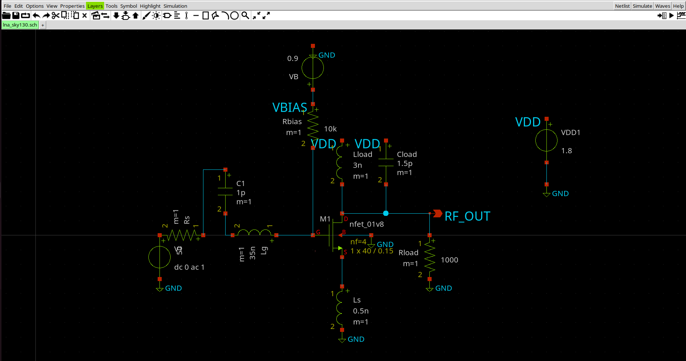
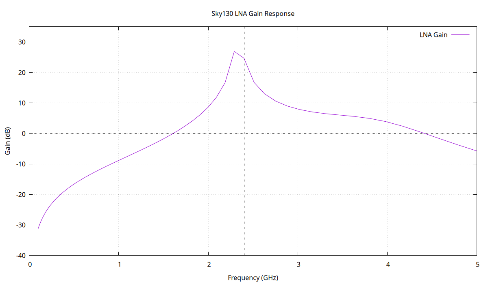
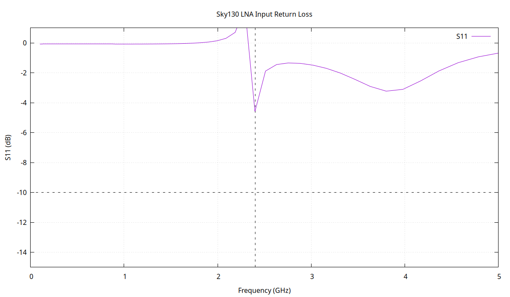

# SKY130 2.4 GHz RF Low-Noise Amplifier

A student-level RF integrated circuit design and simulation project implementing a
2.4 GHz CMOS Low-Noise Amplifier using the open-source SkyWater SKY130 Process Design Kit.

## Overview

This project explores the transistor-level design and AC-frequency response of a
CMOS RF LNA targeting the 2.4 GHz ISM band.

The amplifier is implemented using the SKY130
`sky130_fd_pr__nfet_01v8` device model and simulated using ngspice.

The project demonstrates an RFIC design workflow including:

- CMOS transistor-level RF amplifier design
- Input network design
- Frequency-response analysis
- Input impedance extraction
- S11 / input-return-loss evaluation
- Component parameter sweeps
- Simulation data extraction
- Result visualization

## LNA Architecture

The design uses a common-source CMOS RF amplifier with:

- NMOS gain transistor
- Source degeneration inductor
- Gate inductive network
- Input coupling capacitor
- RF output load network
- Resistive gate bias
- 1.8 V supply

### Final Input Network

| Component | Value |
|---|---:|
| Gate inductance (Lg) | 35 nH |
| Source degeneration (Ls) | 0.5 nH |
| Input capacitor (C1) | 1 pF |
| Source resistance | 50 Ω |
| Supply voltage | 1.8 V |
| Gate bias | 0.9 V |

## Technology and Simulation

| Parameter | Value |
|---|---|
| Process | SkyWater SKY130 |
| Transistor | `sky130_fd_pr__nfet_01v8` |
| Supply | 1.8 V |
| Target frequency | 2.4 GHz |
| Simulator | ngspice-42 |
| AC sweep | 100 MHz – 10 GHz |

## Final Schematic

The final transistor-level LNA schematic is implemented in Xschem.



## Simulation Results

| Metric | Result |
|---|---:|
| Maximum gain | 26.90 dB |
| Peak gain frequency | 2.291 GHz |
| Gain @ 2.4 GHz | 24.61 dB |
| S11 @ 2.4 GHz | -4.59 dB |
| Zin @ ~2.4 GHz | 197.24 - j5.05 Ω |

The simulated amplifier exhibits strong frequency-selective amplification
around the intended 2.4 GHz operating region.

## Gain Response



The simulated amplifier reaches a maximum gain of approximately 26.9 dB
at 2.291 GHz.

At the target frequency of 2.4 GHz, the simulated gain is approximately
24.6 dB.

## Input Return Loss



The simulated S11 at approximately 2.4 GHz is -4.59 dB.

The input matching network was explored through inductance and capacitance
sweeps. The current design demonstrates RF amplification and frequency-selective
behavior, but the input network is not fully optimized for a production-quality
50 Ω match.

## Input Impedance

At approximately 2.4 GHz, the simulated input impedance is:

```text
Zin ≈ 197.24 - j5.05 Ω
